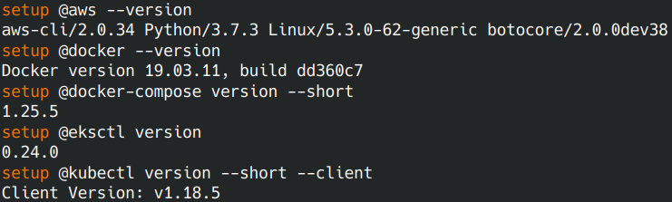

# AWS Cloud Developer - Udagram Image Filtering Microservice!

# Submitter: Quyet, Nguyen Ngoc

## Context

The project application, Udagram - an Image Filtering application, allows users to register and log into a web client, post photos to the feed, and process photos using an image filtering microservice. It has two components:

 1. Frontend - Angular web application built with Ionic framework
 2. Backend RESTful API - Node-Express application

In this project you will:

1. Refactor the monolith application to microservices
2. Set up each microservice to be run in its own Docker container
3. Set up a Travis CI pipeline to push images to Dockerhub
4. Deploy the Dockerhub images to the Kubernetes cluster

## Udagram Image Filtering Microservice

Udagram allows users to register and log into a web client, post photos to the feed, and process photos using an image filtering microservice.

The project is split into four parts:

1. [The Frontend](udagram-frontend), an Ionic client web application which consumes the RestAPI feed and user.
2. [The RestAPI Feed Backend](udagram-api-feed), a Node-Express feed microservice.
3. [The RestAPI User Backend](udagram-api-user), a Node-Express user microservice.
4. [The reverse proxy server](udagram-reverseproxy), a NGINX proxy server.

## Getting started

### Prerequisites

Required tools need to be install:

1. [AWS CLI](https://docs.aws.amazon.com/cli/latest/userguide/install-cliv2-linux.html)
2. [Docker](https://docs.docker.com/get-docker/)
3. [Docker Compose](https://docs.docker.com/compose/install/)
4. [Eksctl](https://docs.aws.amazon.com/eks/latest/userguide/getting-started-eksctl.html)  
5. [Kubectl](https://docs.aws.amazon.com/eks/latest/userguide/install-kubectl.html)

### Installation

Test that your installation is successful with the following commands:

```bash
aws --version
docker --version
docker-compose version --short
eksctl version
kubectl version --short --client
```



### Setup Environment Variables

Open your bash profile to store your application variables at OS level to use them within and across applications:

```bash
open ~/.profile
```

Copy and Paste the bash scripts bellow with your values:

```bash
export DB_USERNAME=your postgress username;
export DB_PASSWORD=your postgress password;
export DB_NAME=your postgress database;
export DB_HOST=your postgress host;
export AWS_REGION=your aws region;
export AWS_PROFILE=your aws profile;
export AWS_MEDIA_BUCKET=your aws bucket name;
export JWT_SECRET=your jwt secret;
export ACCESS_CONTROL_ALLOW_ORIGIN=url of the frontend;
```

Source your .profile to execute your bash scripts automatically whenever a new interactive shell is started:

```bash
source ~/.profile
```  

### Run the application locally using Docker

#### 1) Pull existing or build new images

To run the docker images, 2 options:

- 1. Get Docker existing images from Docker Hub
- 2. Build the new Docker images

##### 1) Get Docker existing images from Docker Hub

The project's images are available on Docker Hub :

- [quyetnn1102/udagram-api-feed](https://hub.docker.com/repository/docker/quyetnn1102/udagram-api-feed)
- [quyetnn1102/udagram-api-user](https://hub.docker.com/repository/docker/quyetnn1102/udagram-api-user)
- [quyetnn1102/udagram-frontend](https://hub.docker.com/repository/docker/quyetnn1102/udacity-frontend)
- [quyetnn1102/udagram-reverseproxy](https://hub.docker.com/repository/docker/quyetnn1102/udacity-nginx-reverseproxy)


Just push these images executing this script:

```bash
docker pull quyetnn1102/udagram-api-feed:latest
docker pull quyetnn1102/udagram-api-user:latest
docker pull quyetnn1102/udagram-reverseproxy:latest
docker pull quyetnn1102/udagram-frontend:latest
```

##### 2) Build the new Docker images

Build the docker images by following the documentation in [udagram-deployment/docker](udagram-deployment/docker)

#### 2) List your docker images

Check images available : `docker images`  


#### 3) Run

Run your docker containers: `docker-compose up`  

  

#### 4) Access Udagram

Browse the frontend application : <http://localhost:8100/>


To exit run `control + C`

### Run with a Kubernetes Cluster on Amazon EKS

Create your cluster with `eksctl` by following documentation in [udagram-deployment/eks](udagram-deployment/eks)

Your cluster is created and visible in the [AWS Console/EKS](https://eu-west-3.console.aws.amazon.com/eks/home#/clusters):


#### Setup Kubernetes Environment

Setup the ubernetes environment by following the documentation in [udagram-deployment/k8s](udacity-c3-deployment/k8s)

#### Check status of all resources (services, delpoyments, pods, hpa)

```bash
kubectl get all
```


#### Check pods logs

```bash
kubectl logs <podId>
```


#### Connect the Services with Port Forwarding

Use Port Forwarding to the Frontend and Reverse Proxy services:
The port forwarding must be done in Separate terminals, to run both services at the same time.

```bash
kubectl port-forward service/frontend 8100:8100
kubectl port-forward service/reverseproxy 8080:8080
```

Browse the frontend application : <http://localhost:8100/>

### CI/CD with Travis

- Sign up for [Travis](https://travis-ci.com) and connect your Github application repository to TravisCL.
- Have a look to the [config file](.travis.yml) that will be read by Travis, at the root of the repository. It needs some environment variables.
- Add your environment variables to the project repository in [Travis](https://travis-ci.com) by selecting the setting option.
- Commit and Push your changes trigger a Travis build.
- Check the build status page to see if your build passes or fails according to the return status of the build command by visiting [TravisCL](https://travis-ci.com) and selecting your repository.


